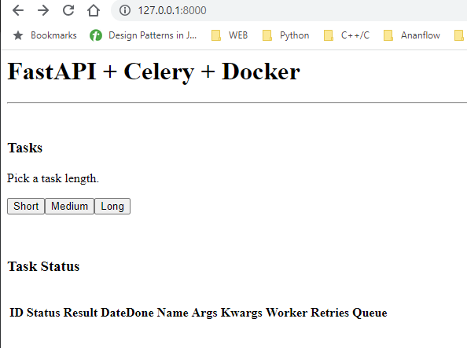
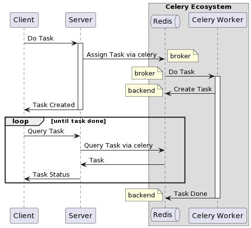
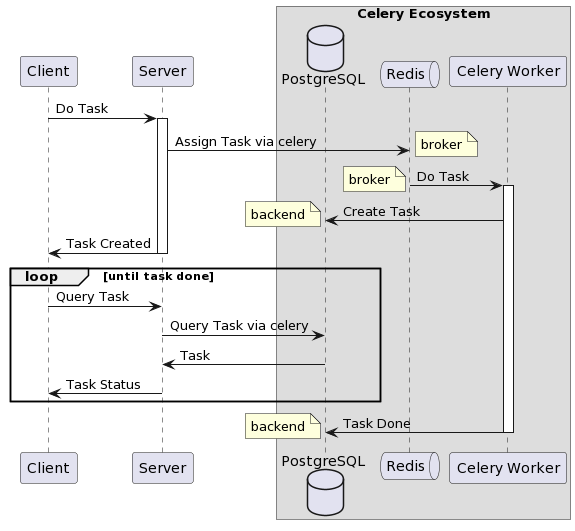

# FastAPI + Celery Example

An example microservices illustrates how to perform heavy background computation task such as running machine learning model.



## Case 1

Celery uses `Redis` as both of `broker` and `backend`.

Tech stack:

- FastAPI
- Celery
  - Redis: as broker and backend

Workflow:



## Case 2

Celery uses  `Redis` as `broker` and `PostgresSQL` as `backend`.

Tech stack:

- FastAPI
- Celery
  - Redis: as broker
  - PostgresSQL: lower backend
  - SQLAlchemy: higher backend

Workflow:



_NOTE_:

- `broker` is where `Celery` transport message into a queue
- `backend` is where `Celery` store the result
- FastAPI will not involve with `Redis` and `PostgresSQL` directly, it's done through `Celery`
- Celery will manage backend `PostgresSQL` database via `SQLAlchemy`
- Celery will manage broker `Redis`
- Celery will detect schema [Task and TaskSet](https://docs.celeryq.dev/en/latest/internals/reference/celery.backends.database.models.html#celery.backends.database.models) in PostgreSQL and generate lazily when doing on the first job run.

## Get Started

Case 1:

```sh
docker-compose -f docker-compose-redis.yml build
# CTRL+C: just stop containers while keeping data
docker-compose -f docker-compose-redis.yml up
# Remove containers with wiping data
docker-compose -f docker-compose-redis.yml down 
```

Case 2:

```sh
docker-compose -f docker-compose-db.yml build
# CTRL+C: just stop containers while keeping data
docker-compose -f docker-compose-db.yml up
# Remove containers with wiping data
docker-compose -f docker-compose-db.yml down 
```
