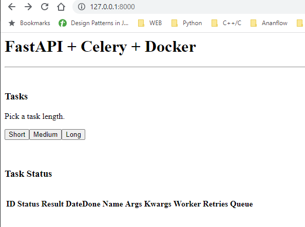
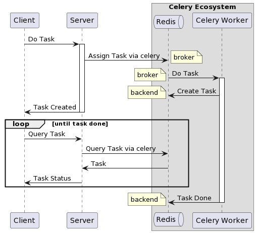

# FastAPI + Celery demo

A demo using **FastAPI** and **Celery** implements a microservices web application which can:

- Perform machine learning tasks or other heavy computation task.
- Send emails.
- Do other tasks.



In this demo, we will distribute different tasks to dedicated workers:

- **Celery** uses `Redis` as both of `broker` and `backend`.
- There are multiple **Celery** workers to do their separate tasks:
  - **ml-worker** will only handle detecting spam tasks
  - **email-worker** will only handle email related tasks
  - **worker** will help do some testing
- Run workers in `--pool=solo` or `--pool=prefork --concurrency=1` mode for computing intensive tasks.

Tech stack:

- FastAPI
- Celery
- Redis: as broker and backend

Workflow:



_NOTE_:

- `broker` is where `Celery` transport message into a queue
- `backend` is where `Celery` store the result
- `FastAPI` will not involve with `broker` and `backend` directly, it's done through `Celery`
- `Celery` will use schema [Task and TaskSet](https://docs.celeryq.dev/en/latest/internals/reference/celery.backends.database.models.html#celery.backends.database.models) to store task result.

## Get Started

```sh
docker-compose build

docker-compose up -d
```

## Redis CLI

```sh
redis-cli -h redis -p 6379
```

```sh
KEYS *

TYPE celery
TYPE unacked


```

## Celery task

What's the lifecycle of a Celery task from the time it's created to the it's done?

Here we analyze a simple task with all **Celery** configuration in default and use **Redis** as **broker** and **backend**

```py
@app.task(acks_late=True)
def wait(secs: float) -> str:
    print(f"wait() - Start, secs[{secs}]s")
    time.sleep(secs)
    print(f"wait() - Done, secs[{secs}]s")
    return f"wait() - Done, secs[{secs}]s"
```

1. When a client call `wait.delay(60)`, this task is added to a default queue named `celery` in **Redis**.
2. **Celery** worker polls the queue and pulls the task, then it removes the task from the queue and moves it a special queue named `unacked` in **Redis**.
3. The worker holds on to the task(`prefetch`), until it has abilities to process the task.
4. Once after The worker successfully processes the task, it `acks` now (`acks_late=True`) that it removes the task from the `unacked` queue in **Redis**.
   - If `acks_late=False`, the worker `acks` before processing the task.

Let's get more concrete understanding in practices.

1. First, let's enter a `redis-cli` interactive mode with the newly launched application,

```sh
127.0.0.1:6379> KEYS *
1) "_kombu.binding.email_service"
2) "_kombu.binding.ml_service"
3) "_kombu.binding.celery.pidbox"
4) "_kombu.binding.celeryev"
5) "_kombu.binding.celery"
```

At the beginning, you can see that the `celery` key and the `unacked` key do not exist in **Redis**.

2. Then, let's call `wait.delay(60)` multiple times at the same time,

```sh
127.0.0.1:6379> KEYS *
 1) "unacked_index"
 2) "_kombu.binding.email_service"
 3) "_kombu.binding.celery.pidbox"
 4) "celery-task-meta-3d6b2028-6ee6-4e2c-85f1-cbeba644aca5"
 5) "celery"
 6) "_kombu.binding.celeryev"
 7) "_kombu.binding.celery"
 8) "_kombu.binding.ml_service"
 9) "celery-task-meta-e5a1b7db-f1ad-4d3e-b2b9-3b7de8f8c87e"
10) "unacked"
127.0.0.1:6379> TYPE unacked
hash
127.0.0.1:6379> TYPE celery
list
```

After we create tasks, the `celery` key of `list` type and the `unacked` key of `hash` type are both created in **Redis**.

```sh
127.0.0.1:6379> LRANGE celery 0 -1
1) "{\"body\": \"W1s2MC4wXSwge30sIHsiY2FsbGJhY2tzIjogbnVsbCwgImVycmJhY2tzIjogbnVsbCwgImNoYWluIjogbnVsbCwgImNob3JkIjogbnVsbH1d\", \"content-encoding\": \"utf-8\", \"content-type\": \"application/json\", \"headers\": {\"lang\": \"py\", \"task\": \"app.celery_app.tasks.wait\", \"id\": \"da959152-1f45-4846-99e4-5205d30c1be7\", \"shadow\": null, \"eta\": null, \"expires\": null, \"group\": null, \"group_index\": null, \"retries\": 0, \"timelimit\": [null, null], \"root_id\": \"da959152-1f45-4846-99e4-5205d30c1be7\", \"parent_id\": null, \"argsrepr\": \"(60.0,)\", \"kwargsrepr\": \"{}\", \"origin\": \"gen11@a840cdd15b13\", \"ignore_result\": false}, \"properties\": {\"correlation_id\": \"da959152-1f45-4846-99e4-5205d30c1be7\", \"reply_to\": \"4b0f2f2d-aee2-3349-81ab-e95a1f0e9f02\", \"delivery_mode\": 2, \"delivery_info\": {\"exchange\": \"\", \"routing_key\": \"celery\"}, \"priority\": 0, \"body_encoding\": \"base64\", \"delivery_tag\": \"d657c66d-4e4b-483d-9fbe-fe4b5b9541e7\"}}"
2) "{\"body\": \"W1s2MC4wXSwge30sIHsiY2FsbGJhY2tzIjogbnVsbCwgImVycmJhY2tzIjogbnVsbCwgImNoYWluIjogbnVsbCwgImNob3JkIjogbnVsbH1d\", \"content-encoding\": \"utf-8\", \"content-type\": \"application/json\", \"headers\": {\"lang\": \"py\", \"task\": \"app.celery_app.tasks.wait\", \"id\": \"1ddc3c5e-fa33-4d12-aa3f-c3d13581a4c8\", \"shadow\": null, \"eta\": null, \"expires\": null, \"group\": null, \"group_index\": null, \"retries\": 0, \"timelimit\": [null, null], \"root_id\": \"1ddc3c5e-fa33-4d12-aa3f-c3d13581a4c8\", \"parent_id\": null, \"argsrepr\": \"(60.0,)\", \"kwargsrepr\": \"{}\", \"origin\": \"gen11@a840cdd15b13\", \"ignore_result\": false}, \"properties\": {\"correlation_id\": \"1ddc3c5e-fa33-4d12-aa3f-c3d13581a4c8\", \"reply_to\": \"4b0f2f2d-aee2-3349-81ab-e95a1f0e9f02\", \"delivery_mode\": 2, \"delivery_info\": {\"exchange\": \"\", \"routing_key\": \"celery\"}, \"priority\": 0, \"body_encoding\": \"base64\", \"delivery_tag\": \"927d1ac0-3709-4e23-8c0f-037713c55217\"}}"
```

```sh
127.0.0.1:6379> HGETALL unacked
1) "927d1ac0-3709-4e23-8c0f-037713c55217"
2) "[{\"body\": \"W1s2MC4wXSwge30sIHsiY2FsbGJhY2tzIjogbnVsbCwgImVycmJhY2tzIjogbnVsbCwgImNoYWluIjogbnVsbCwgImNob3JkIjogbnVsbH1d\", \"content-encoding\": \"utf-8\", \"content-type\": \"application/json\", \"headers\": {\"lang\": \"py\", \"task\": \"app.celery_app.tasks.wait\", \"id\": \"1ddc3c5e-fa33-4d12-aa3f-c3d13581a4c8\", \"shadow\": null, \"eta\": null, \"expires\": null, \"group\": null, \"group_index\": null, \"retries\": 0, \"timelimit\": [null, null], \"root_id\": \"1ddc3c5e-fa33-4d12-aa3f-c3d13581a4c8\", \"parent_id\": null, \"argsrepr\": \"(60.0,)\", \"kwargsrepr\": \"{}\", \"origin\": \"gen11@a840cdd15b13\", \"ignore_result\": false}, \"properties\": {\"correlation_id\": \"1ddc3c5e-fa33-4d12-aa3f-c3d13581a4c8\", \"reply_to\": \"4b0f2f2d-aee2-3349-81ab-e95a1f0e9f02\", \"delivery_mode\": 2, \"delivery_info\": {\"exchange\": \"\", \"routing_key\": \"celery\"}, \"priority\": 0, \"body_encoding\": \"base64\", \"delivery_tag\": \"927d1ac0-3709-4e23-8c0f-037713c55217\"}}, \"\", \"celery\"]"
```

3. Wait for all these tasks to be done

```sh
127.0.0.1:6379> KEYS *
 1) "_kombu.binding.email_service"
 2) "celery-task-meta-da959152-1f45-4846-99e4-5205d30c1be7"
 3) "celery-task-meta-815587f5-782d-454a-8498-b4ebbb91abd8"
 4) "_kombu.binding.celery.pidbox"
 5) "celery-task-meta-3d6b2028-6ee6-4e2c-85f1-cbeba644aca5"
 6) "_kombu.binding.celeryev"
 7) "_kombu.binding.celery"
 8) "_kombu.binding.ml_service"
 9) "celery-task-meta-1ddc3c5e-fa33-4d12-aa3f-c3d13581a4c8"
10) "celery-task-meta-e5a1b7db-f1ad-4d3e-b2b9-3b7de8f8c87e"
```

After all tasks are done successfully, both keys: `celery` and `unacked` are removed from **Redis**.

The result of a task is stored in `celery-task-meta-{{uuid}}` key.

```sh
127.0.0.1:6379> TYPE celery-task-meta-da959152-1f45-4846-99e4-5205d30c1be7
string
127.0.0.1:6379> GET celery-task-meta-da959152-1f45-4846-99e4-5205d30c1be7
"{\"status\": \"SUCCESS\", \"result\": \"wait() - Done, secs[60.0]s\", \"traceback\": null, \"children\": [], \"date_done\": \"2023-11-07T07:54:16.954872\", \"task_id\": \"da959152-1f45-4846-99e4-5205d30c1be7\"}"
```
